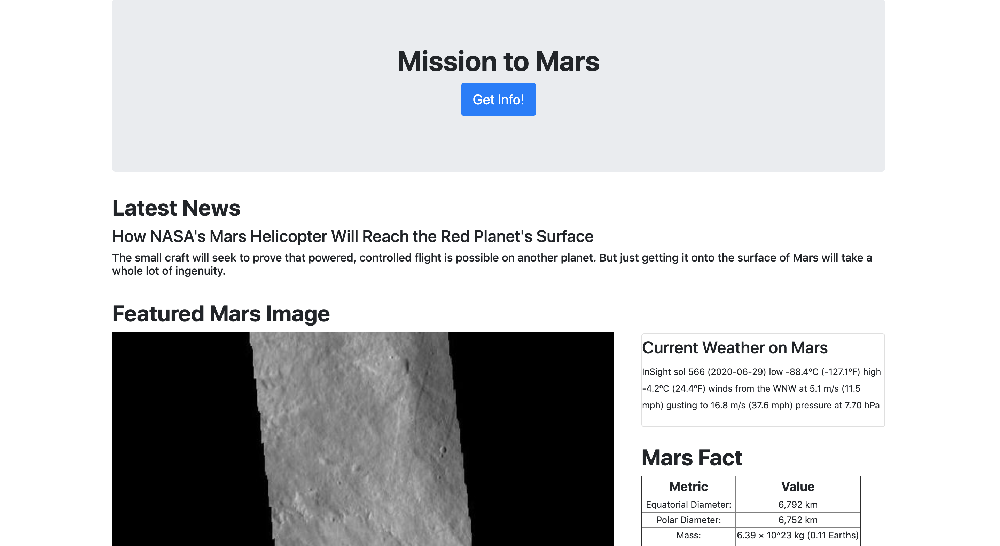
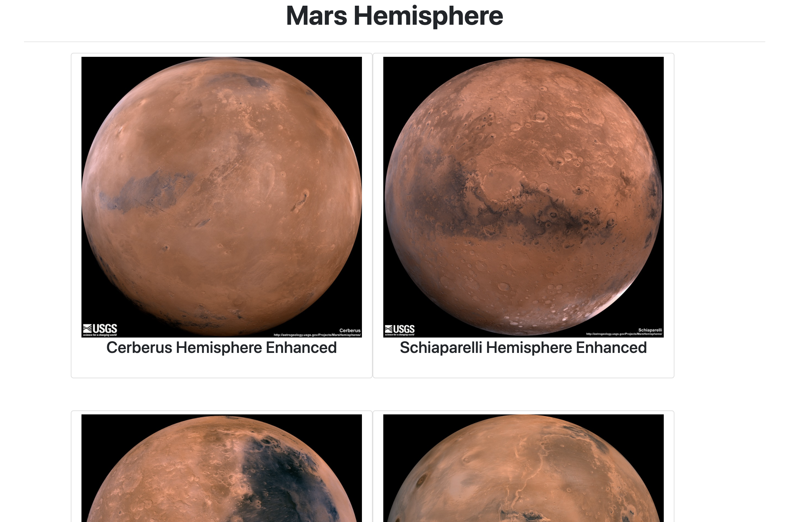

# web-scraping-challenge

## Objective
#### Deploy a Flask API, which scrape NASA Mars newest Project data,  on heroku.
#### You can find the webpage at: https://shrouded-harbor-91603.herokuapp.com/

## Library:
* Flask
* PyMongo
* pymongo
* BeautifulSoup
* selenium
* re
* Pandas
* time

## Scraping Data Source
* https://mars.nasa.gov/news/
* https://www.jpl.nasa.gov/spaceimages/?search=&category=Mars
* https://twitter.com/marswxreport?lang=en
* https://space-facts.com/mars/
* https://astrogeology.usgs.gov/search/results?q=hemisphere+enhanced&k1=target&v1=Mars

## Flask Application and WebPage

